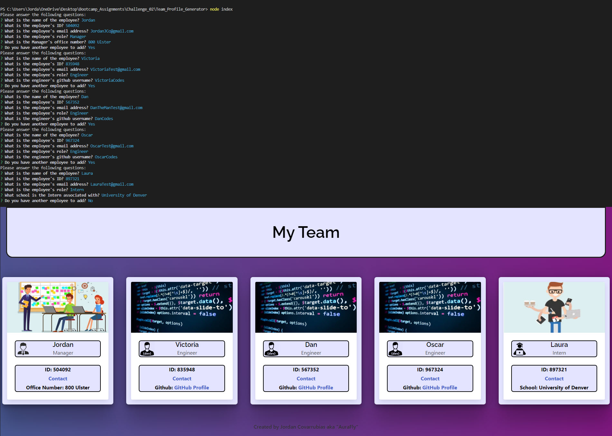
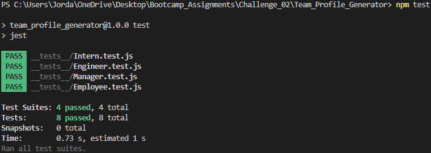

# Team_Profile_Generator
  

  ## Description:
Section 10 (OOP) assignment/challenge. I have been asked to build a Node.js CL application that takes in information about employees on a software engineering team, then generates an HTML webpage that displays summaries for each person. This will also require that I utilize tests to ensure my code is working and maintaibable.

  ## Table of Contents
  - [Installation](#installation)
  - [Usage](#usage)
  - [Contribution](#contribution)
  - [License](#license)
  - [Git Info](#git-info)
  - [Contact](#contact-me)

  # Installation
  The user must have the inquerer and jest npm packages installed.

  # Usage
  Navigate to the project directory using a terminal and run 'node index.js'. This will kick off the inquirer script that will ask several questions about the employee and repeat as long
  as the user answers "yes" to having another employee to add. Once "No" is answered an html will be generated with cards showing the employees information labeled as "team.html".

  

  Link to video tutorial:
  [Video Tutorial](https://drive.google.com/file/d/1_hmPkTCVQOQvbsp3kG3aQYVLWa3Jfj6L/view?usp=sharing)

  # Tests
  4 Test suites made for each class 'Employee, Manager, Engineer, and Intern'
  Each suite tests the class properties and methods and ensures they function as expected when called.
  

  # Contribution
  Open to any and all contributions!

  # Git Info
  Username: AuraFly
  https://github.com/AuraFly

  # Contact Me
  [Contact Me](mailto:AuraFlyDev@gmail.com)

  # License
  This application is covered under the MIT open source license.

